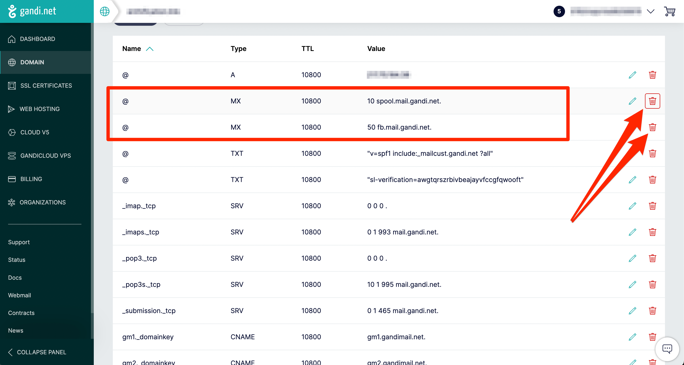
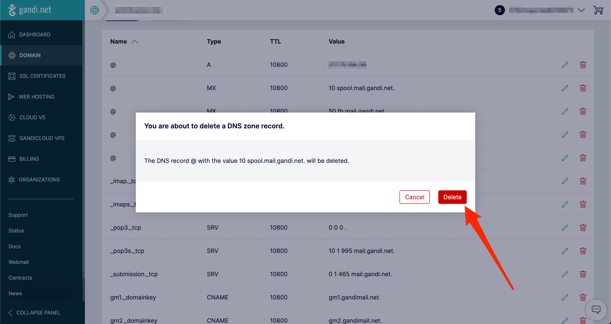
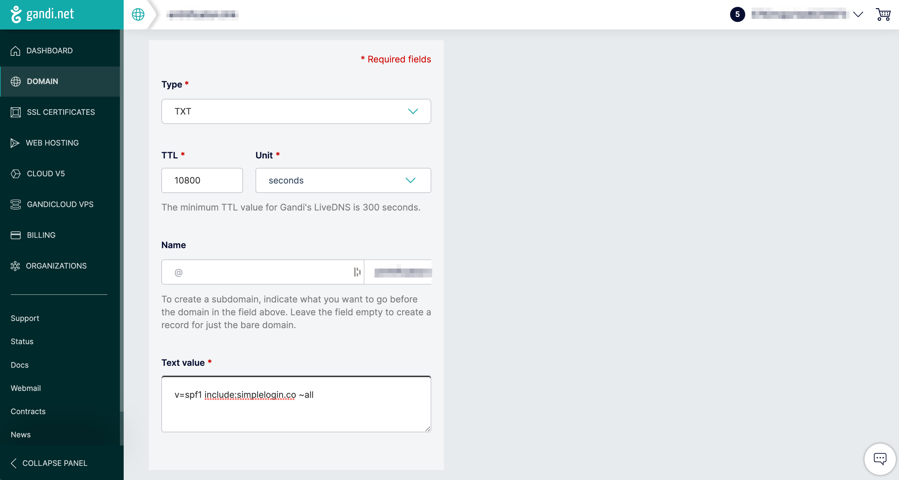
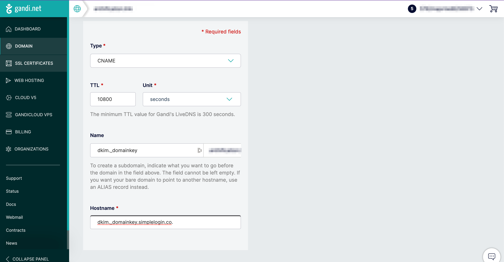
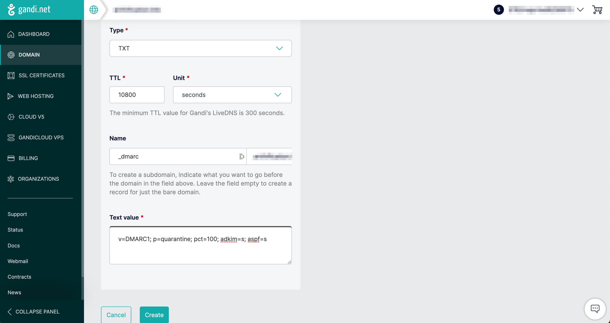

# How to add a Gandi domain to SimpleLogin

## **Add your domain to SimpleLogin**

You have a domain name bought on [Gandi](https://gandi.net) and you want to use it on SimpleLogin? This documentation will show you how to add your Gandi domain in SimpleLogin.

Head to the SimpleLogin [domain page](https://app.simplelogin.io/dashboard/custom_domain) and add your domain:

You'll be redirected to SimpleLogin DNS page that has a guide to set up different DNS records for your domain.

## **Access the domain DNS Records of your domain in Gandi**

To access the Gandi domain DNS configurations panel of your domain click on **“Domain”** on the left sidebar. 

Click on the domain you would like to add to SimpleLogin.

Once on your domain’s page, click on **“DNS Records”** in the top bar menu.

## 1. **Add TXT record on Gandi DNS Records to verify your domain ownership**

From [Gandi’s DNS configuration panel](/docs/custom-domain/registrars/gandi/gandi/#access-the-domain-DNS-records-of-your-domain-in-gandi), click on the **“Add record”**

Then create a TXT record with the data from the SimpleLogin DNS page.

- Set the record **Type** to `TXT`
- Keep the value `@` under in the **Name** field
- Keep the default **TTL** value
- Copy/paste the value of SimpleLogin DNS page in the **Text value** field

Now click on **"Verify"** on SimpleLogin, your domain ownership should be now verified. Please note that it can take up to several minutes for the DNS change to be available. In this case don't hesitate to click on **"Verify"** several minutes later.

Once your domain ownership is verified, you can continue with the rest of the setup.

## 2. **Add MX record on a Gandi domain**

**Delete Gandi existing DNS records**

Gandi DNS configuration already contains MX records that point to Gandi’s server. In this case, we want the MX records to point to SimpleLogin’s servers.
So make sure to delete all existing MX records (by default there should be only two).

To delete an MX records from the [Gandi’s DNS configuration panel](/docs/custom-domain/registrars/gandi/gandi/#access-the-domain-DNS-records-of-your-domain-in-gandi), click on the **“Trash” icon** for each MX records and click “**Delete”**.
 

Once all default MX records deleted, we need to add SimpleLogin MX records. From the [Gandi’s DNS configuration panel](/docs/custom-domain/registrars/gandi/gandi/#access-the-domain-DNS-records-of-your-domain-in-gandi), click on the **“Add record”** again.

**Then create a first MX record with:**

- Set the record **Type** to `MX`
- Keep the value `@` under in the **Name** field
- Keep the default **TTL** value
- Set **Priority** to `10`
- Add the value `mx1.simplelogin.co.` under in the **Hostname** field

**(again) Repeat this step and create a second MX record with:**

- Set the record **Type** to `MX`
- Keep the value `@` under in the **Name** field
- Keep the default **TTL** value
- Set **Priority** to `20`
- Add the value `mx2.simplelogin.co.` under in the **Hostname** field

Now click on **"Verify"** on SimpleLogin, the MX records should be now verified. As it can take up to several minutes for the DNS change to be available, don't hesitate to click on **"Verify"** several minutes later.

Once the MX record is verified, you can start creating aliases with your domain! Click on **"New Custom Alias"**, you should now see your domain in the list of available domains.

## **(Optional) 3. Add TXT record on a Gandi domain for SPF**

Setting up SPF is recommended if you plan to send emails from your aliases. It'll reduce the chance your emails ending up in the recipient's Spam folder.

From the [Gandi’s DNS configuration panel](/docs/custom-domain/registrars/gandi/gandi/#access-the-domain-DNS-records-of-your-domain-in-gandi), click on the **"Add record"** button, then add the following TXT record:

- Set the record **Type** as `TXT`
- Keep the value `@` under in the **Name** field
- Keep the default **TTL** value
- Copy/paste `v=spf1 include:simplelogin.co ~all` in the **Text value** field

Go back to SimpleLogin and click on **"Verify",** the SPF should be now verified.

## **(Optional) 4. Add CNAME record a Gandi domain for DKIM**

Similar to SPF, setting up DKIM is recommended if you plan to send emails from your aliases. It'll reduce the chance your emails ending up in the recipient's Spam folder. We will add 3 DKIM records to your DNS configuration.

From the [Gandi’s DNS configuration panel](/docs/custom-domain/registrars/gandi/gandi/#access-the-domain-DNS-records-of-your-domain-in-gandi), click on the **"Add record"** button, then add the following CNAME record:

**Add a first DKIM record**

- Set the record **Type** as `CNAME`
- Keep the default **TTL** value
- Add the value `dkim._domainkey01` under in the **Name** field
- Add the value `dkim._domainkey01.simplelogin.co.` to **Hostname**

**(again)** **Repeat the same operation and add a second DKIM record**

- Set the record **Type** as `CNAME`
- Keep the default **TTL** value
- Add the value `dkim._domainkey02` under in the **Name** field
- Add the value `dkim._domainkey02.simplelogin.co.` to **Hostname**

**(again) Repeat the same operation and add a third DKIM record (last one, and we’re done)**

- Set the record **Type** as `CNAME`
- Keep the default **TTL** value
- Add the value `dkim._domainkey03` under in the **Name** field
- Add the value `dkim._domainkey03.simplelogin.co.` to **Hostname**

Go back to SimpleLogin and click on **"Verify"**, the DKIM should be now verified.

## **(Optional) 5. Add TXT record for DMARC on a Gandi domain**

Once you have SPF and DKIM set up, setting up DMARC is recommended to even reduce further the chance your emails ending up in the recipient's Spam folder.

From the [Gandi’s DNS configuration panel](/docs/custom-domain/registrars/gandi/gandi/#access-the-domain-DNS-records-of-your-domain-in-gandi), click on the **"Add record"** button, then add the following TXT record:

- Set the record **Type** as `TXT`
- Keep the default **TTL** value
- Add the value `_dmarc` under in the **Name** field
- Copy/paste the value `v=DMARC1; p=quarantine; pct=100; adkim=s; aspf=s` in the **Text vakue** field

Go back to SimpleLogin and click on **"Verify"**, the DMARC should be now verified.

