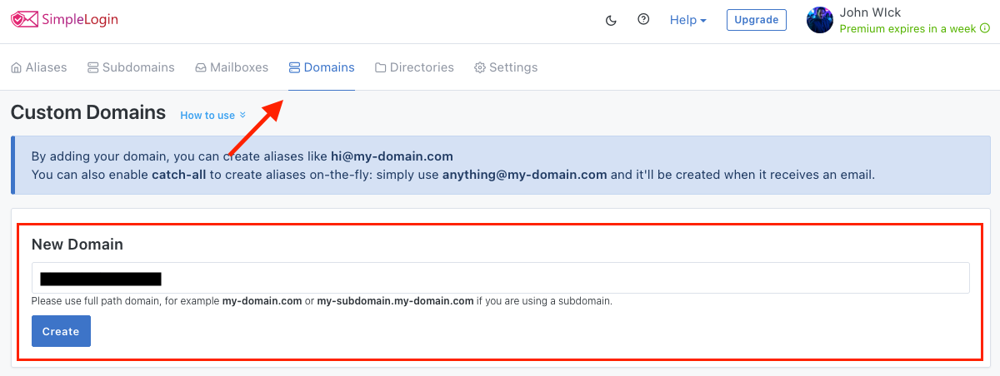
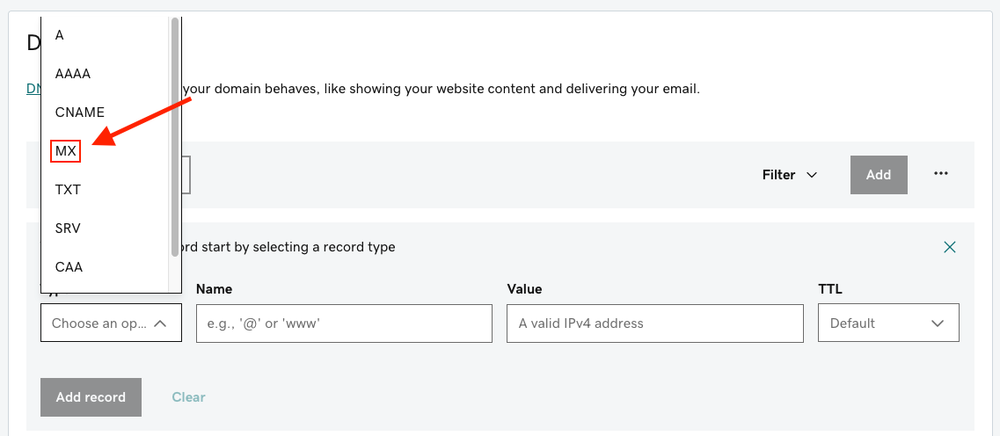
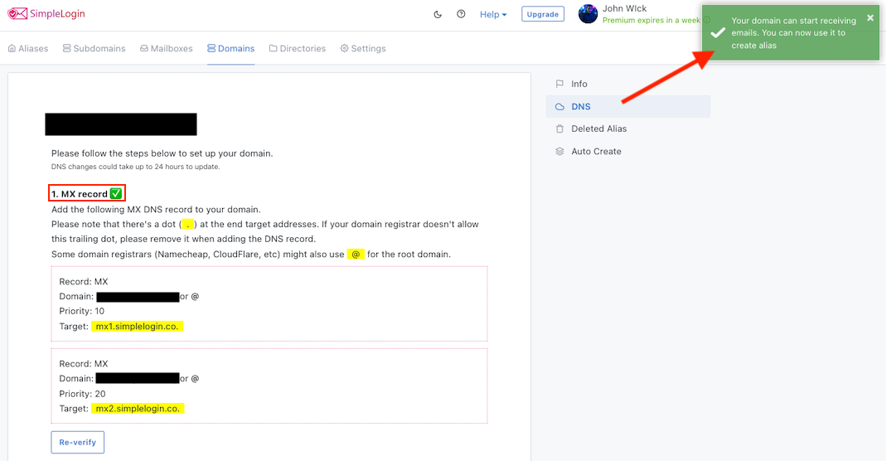
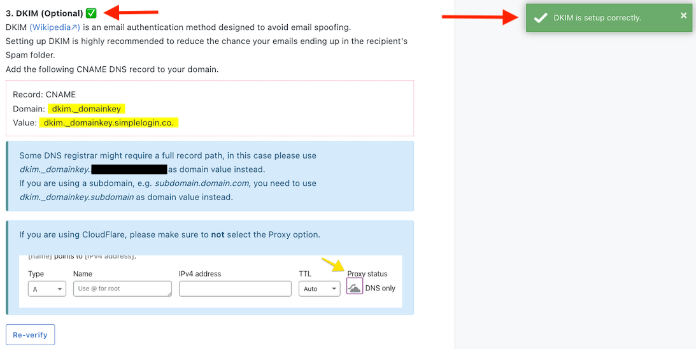
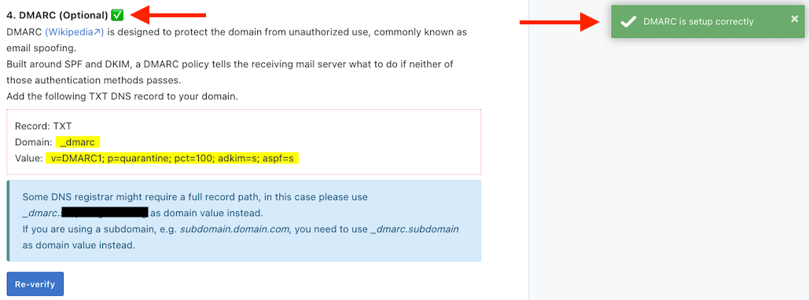

# How to add your GoDaddy domain to SimpleLogin

## Adding your domain to SimpleLogin

Head to the SimpleLogin [domain page](https://app.simplelogin.io/dashboard/custom_domain) and add your domain in to the field.

You'll then be redirected to the SimpleLogin DNS setup page that has a guide on how to set up different DNS records for your domain.

## Verify domain ownernership

To verify ownership of your domain, press on the "Manage DNS" button under the "Domain" selection in the left sidebar in your GoDaddy dashboard.

Then create a TXT record and add the appropriate values from the SimpleLogin DNS setup screen in to the appropriate fields in GoDaddy.

After adding the appropriate values from the SimpleLogin DNS setup screen in to the appropriate fields in GoDaddy and waiting for it to be verified in the SimpleLogin DNS setup screen after having pressed "Verify" in SimpleLogin. It should look something like this.

Once it looks like that, you want to go ahead and add the SimpleLogin MX records. But before you do that, you want to make sure that if you have any existing MX records in your DNS Zone, that you remove them first by pressing the "Delete" button on them.

## Add MX records to GoDaddy

First press on "ADD" button in GoDaddy:

Then select MX in the record type:

Then add the following Values, Name, and Priorities to the MX records: 

- "Name" = @
- "Priorities" = 10 and 20 (10 for the first one 20 for the second one)
- "Values" = `mx1.simplelogin.co.` and `mx2.simplelogin.co.`(mx1 being the one you first want to add in the first MX record and mx2 being the second one you want to add in the second MX record)

Now press on "Verify" in the SimpleLogin DNS setup screen under the "MX record" selection. And wait a bit as it can take up to several minutes (or hours) before it has propagated on the web for everyone to seen, and also don't hesitate to press on "Verify" several times to see if it has propagated yet.

Once the MX records are verified, you can start creating aliases with your domain!

## (Optional) Adding Sender Policy Framework to GoDaddy

Setting up a SPF (Sender Policy Framework) policy for your domain is highly recommended if you plan to send emails from your aliases. It'll reduce the chance of your emails ending up in a recipient's Spam Folder.

In GoDaddy, press the "ADD" button, then select the following record Type, Name, and Value in the record to add a SPF policy to your domain:

- "Type" = TXT
- "Name" = @
- "Value" = `v=spf1 include:simplelogin.co ~all`

Now, after having done that, go back to the SimpleLogin DNS setup screen and press on "Verify" to see if the SPF selection has been verified or not.

If it has, it should look something like this:

If it hasn't, then double check the setup and fix any mistakes.

## (Optional) Adding DomainKeys Identified Mail to GoDaddy

Similar to SPF, setting up DKIM (DomainKeys Identified Mail) policy for your domain is highly recommended if you plan to send emails from your aliases.

In GoDaddy, press the "ADD" button, then select the following record Type, Name, and Value in the record to add DKIM to your domain:

- "Type" = CNAME
- "Name" = `dkim._domainkey`
- "Value" = `dkim._domainkey.simplelogin.co.`

Now, same as before with the SPF policy, go back to the SimpleLogin DNS setup screen and press on "Verify" to see if the DKIM selection has been verified or not.

If it has, it should look something like this:

If it hasn't, then double check the setup and fix any mistakes.

## (Optional) Adding Domain-based Message Authentication Reporting & Conformance to GoDaddy

Once you have set up the SPF and DKIM policies for your domain, setting up a DMARC (Domain-based Message Authentication Reporting & Conformance) policy is also recommended to even further reduce the chance of your emails ending up in the recipient's Spam Folder.

And again, same as before. In GoDaddy, press the "ADD" button, then select the following record Type, Name, and Value in the record to add the DMARC policy to your domain:

- "Type" = TXT
- "Name" = `_dmarc`
- "Value" = `v=DMARC1; p=quarantine; pct=100; adkim=s; aspf=s`

And again, same as before with the SPF and DKIM policies, go back to the SimpleLogin DNS setup screen and press on "Verify" to see if the DMARC selection has been verified or not.

Once again, if it has, it should look something like this:

If it hasn't, then double check the setup and fix any mistakes.

# The End

Congratulations you now have offically setup SimpleLogin to work with your domain!
